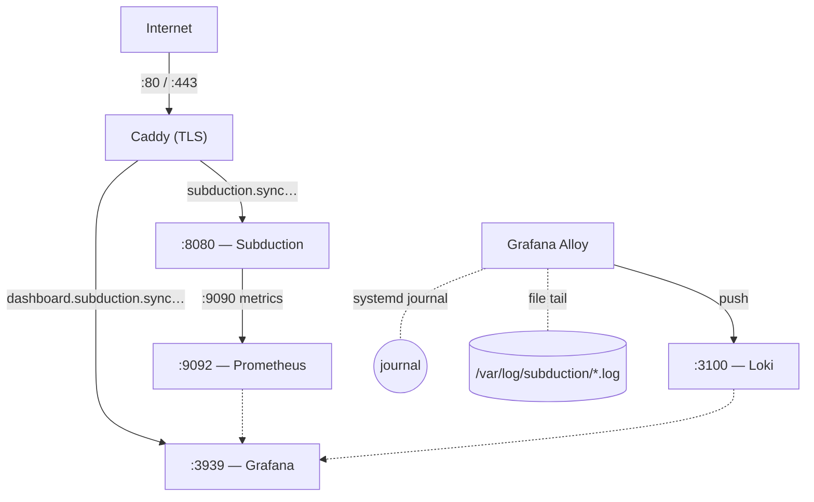

# Bedrock

NixOS configuration for a DigitalOcean droplet running a
[Subduction](https://github.com/inkandswitch/subduction) sync server
with full observability.

## Architecture



Caddy terminates TLS via Let's Encrypt and reverse-proxies to
Subduction and Grafana. Prometheus scrapes Subduction metrics.
Grafana Alloy ships the systemd journal and Subduction log files to
Loki. Tailscale provides a mesh VPN overlay for administrative access.

## Files

| File                         | Purpose                                                                                          |
|------------------------------|--------------------------------------------------------------------------------------------------|
| `flake.nix`                  | Flake entry point — pins nixpkgs, disko, home-manager, and subduction                            |
| `configuration.nix`          | System services: Subduction, Caddy, Prometheus, Loki, Grafana Alloy, Grafana, Tailscale, OpenSSH |
| `digitalocean.nix`           | DigitalOcean platform support: cloud-init, DO metadata services, networking                      |
| `disk-config.nix`            | Disko partition layout (BIOS boot + ext4 root on `/dev/vda`)                                     |
| `hardware-configuration.nix` | Extra kernel modules for DO/QEMU hardware                                                        |
| `home.nix`                   | Minimal home-manager config (fish, starship, git, iroh, ripgrep)                                 |
| `nix.nix`                    | Nix daemon settings (flakes, GC, trusted substituters)                                           |

## Deploying

### Initial provisioning

Create a DigitalOcean droplet (Ubuntu 24.04, SSH key added), point
`subduction.sync.inkandswitch.com` DNS at its IP, then provision with
[nixos-anywhere](https://github.com/nix-community/nixos-anywhere):

```bash
nix run github:nix-community/nixos-anywhere -- \
  --flake .#bedrock \
  root@<droplet-ip>
```

### Post-install: provision subduction key

```bash
ssh <USERNAME>@subduction.sync.inkandswitch.com
sudo mkdir -p /var/lib/subduction
sudo dd if=/dev/urandom bs=32 count=1 of=/var/lib/subduction/key-seed
sudo chmod 600 /var/lib/subduction/key-seed
sudo systemctl restart subduction
```

### Updating the configuration

`nixos-anywhere` is only for the initial install (it wipes the disk).
For ongoing changes, edit the nix files locally and use `nixos-rebuild`
to apply them over SSH:

```bash
nixos-rebuild switch --flake .#bedrock \
  --target-host <USERNAME>@subduction.sync.inkandswitch.com \
  --build-host <USERNAME>@subduction.sync.inkandswitch.com
```

> [!NOTE]
> `--build-host` builds the closure on the remote (required when the
> local machine can't produce `x86_64-linux` derivations, e.g. from
> Apple Silicon). Omit it if you have a remote builder or cross-compilation
> set up locally.

| Mode     | Behaviour                                                             |
| -------- | --------------------------------------------------------------------- |
| `switch` | Build, activate now, add to bootloader                                |
| `test`   | Build and activate now, _don't_ add to bootloader (reverts on reboot) |
| `boot`   | Add to bootloader but don't activate until next reboot                |

## Services

| Service       | Listen Address   | Notes                                                 |
| ------------- | ---------------- | ----------------------------------------------------- |
| Subduction    | `127.0.0.1:8080` | Sync server; key at `/var/lib/subduction/key-seed`    |
| Caddy         | `:80`, `:443`    | Automatic TLS via Let's Encrypt                       |
| Grafana       | `127.0.0.1:3939` | Exposed at `dashboard.subduction.sync.inkandswitch.com` |
| Prometheus    | `:9092`          | Scrapes Subduction metrics on `:9090`                 |
| Loki          | `:3100`          | Log aggregation (TSDB, 14-day retention)              |
| Grafana Alloy | —                | Ships journal + `/var/log/subduction/*.log` to Loki   |
| Tailscale     | —                | Mesh VPN for admin access                             |
| OpenSSH       | `:22`            | Key-only, root login disabled                         |

## Firewall

Only ports **22**, **80**, and **443** are open. All other services
(Grafana, Prometheus, Loki) bind to localhost and are reachable
through Caddy or Tailscale.

## Day-to-day operations

See [`OPERATIONS.md`](./OPERATIONS.md) for a cookbook of common
on-server tasks: tailing logs, filtering by severity, restarting
Subduction, checking disk and inode pressure, inspecting on-disk
state, and the gotchas that come up most often.
