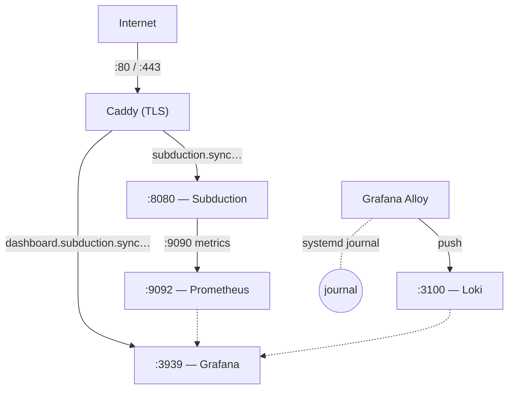

# Bedrock

NixOS configuration for DigitalOcean droplets running a [Subduction](https://github.com/inkandswitch/subduction) sync server with full observability. One flake, several hosts:

| Host        | Role                       | Public DNS                         | Droplet                     |
|-------------|----------------------------|------------------------------------|-----------------------------|
| `bedrock`   | Production                 | `subduction.sync.inkandswitch.com` | 16 GB RAM                   |
| `coln-sync` | Staging (Coln project)     | `coln.sync.inkandswitch.com`       | 2 vCPU, 4 GB RAM, 80 GB disk |

Every host runs the identical software stack from `modules/`; the per-host file in `hosts/` only sets DNS, memory caps, and any extra accounts. Grafana lives at `dashboard.<public DNS>` on each.

## Architecture


```mermaid
graph TD
    Internet -->|":80 / :443"| Caddy["Caddy (TLS)"]

    Caddy -->|subduction.sync…| Subduction[":8080 — Subduction"]
    Caddy -->|dashboard.subduction.sync…| Grafana[":3939 — Grafana"]

    Subduction -->|":9090 metrics"| Prometheus[":9092 — Prometheus"]
    Prometheus -.-> Grafana

    Alloy["Grafana Alloy"] -->|push| Loki[":3100 — Loki"]
    Alloy -.-|systemd journal| Journal(("journal"))
    Loki -.-> Grafana
```

Caddy terminates TLS via Let's Encrypt and reverse-proxies to Subduction and Grafana. Prometheus scrapes Subduction metrics. Grafana Alloy ships the systemd journal to Loki (Subduction logs only to stdout — there's no file-based log source). Tailscale provides a mesh VPN overlay for administrative access.

## Files

| File                                 | Purpose                                                                                          |
|--------------------------------------|--------------------------------------------------------------------------------------------------|
| `flake.nix`                          | Flake entry point — pins inputs; `mkHost` builds one `nixosConfiguration` per entry in `hosts`   |
| `hosts/bedrock.nix`                  | Production: DNS, 11G/13G Subduction memory caps                                                  |
| `hosts/coln-sync.nix`                | Staging: DNS, 4 GB-sized memory caps, extra account                                              |
| `modules/options.nix`                | The `bedrock.*` option set — the _only_ things allowed to differ between hosts                    |
| `modules/common.nix`                 | System services: Subduction, Caddy, Prometheus, Loki, Grafana Alloy, Grafana, Tailscale, OpenSSH |
| `modules/accounts.nix`               | Shared human accounts + SSH keys                                                                 |
| `modules/digitalocean.nix`           | DigitalOcean platform support: cloud-init, DO metadata services, networking                      |
| `modules/disk-config.nix`            | Disko partition layout (BIOS boot + ext4 root on `/dev/vda`)                                     |
| `modules/hardware-configuration.nix` | Extra kernel modules for DO/QEMU hardware                                                        |
| `modules/home.nix`                   | Minimal home-manager config (shell, starship, git, ripgrep)                                      |
| `modules/nix.nix`                    | Nix daemon settings (flakes, GC, trusted substituters)                                           |
| `nix/commands.nix`                   | Laptop dev-shell menu (SSH wrappers; `BEDROCK_TARGET` picks the host)                            |
| `nix/server-commands.nix`            | Same menu, installed on each server                                                              |

### Adding a host

1. Create `hosts/<name>.nix` setting `bedrock.publicHostname`, `bedrock.subduction.memoryHigh`/`memoryMax`, `bedrock.sshMemoryMin`, and `bedrock.stateVersion` (see `modules/options.nix` for the full set and defaults).
2. Add `<name> = ./hosts/<name>.nix;` to `hosts` in `flake.nix`.
3. Add a `Host <name>` alias to your `~/.ssh/config` so the dev-shell commands can reach it.
4. Point DNS at the droplet and provision as below with `--flake .#<name>`.

## Deploying

### Initial provisioning

Create a DigitalOcean droplet (Ubuntu 24.04, SSH key added), point the host's public DNS name at its IP, then provision with [nixos-anywhere](https://github.com/nix-community/nixos-anywhere), substituting the host name (`bedrock`, `coln-sync`):

```bash
nix run github:nix-community/nixos-anywhere -- \
  --flake .#coln-sync \
  root@<droplet-ip>
```

Subduction's signing-key seed is generated automatically by an `ExecStartPre` script on the first boot — no manual `dd if=/dev/urandom` step is required. The seed lives at `/var/lib/subduction/key-seed` and is preserved across rebuilds.

### Updating the configuration

`nixos-anywhere` is only for the initial install (it wipes the disk). For ongoing changes, edit the nix files locally and use `nixos-rebuild` to apply them over SSH:

```bash
nixos-rebuild switch --flake .#bedrock \
  --target-host <USERNAME>@subduction.sync.inkandswitch.com \
  --build-host  <USERNAME>@subduction.sync.inkandswitch.com \
  --sudo
```

Or from the dev shell, where `deploy` does the above for whichever host `BEDROCK_TARGET` names:

```bash
nix develop
BEDROCK_TARGET=coln-sync deploy      # defaults to bedrock when unset
```

- `--sudo` escalates the remote privileged steps via passwordless sudo (root SSH is disabled).
- `--build-host` builds the closure on the droplet rather than locally — required when your laptop can't produce `x86_64-linux` derivations (e.g. Apple Silicon). On an `x86_64-linux` laptop you can drop it and let local Nix build the closure.

See [`COOKBOOK.md` § Rebuild and activate](./COOKBOOK.md#2-rebuild-and-activate) for the full deploy workflow, dry-runs, rollback, and the gotchas (including why you should _not_ prefix the command with a local `sudo`).

## Services

| Service       | Listen Address   | Notes                                                 |
| ------------- | ---------------- | ----------------------------------------------------- |
| Subduction    | `127.0.0.1:8080` | Sync server; key at `/var/lib/subduction/key-seed`    |
| Caddy         | `:80`, `:443`    | Automatic TLS via Let's Encrypt                       |
| Grafana       | `127.0.0.1:3939` | Exposed at `dashboard.<public DNS>`                   |
| Prometheus    | `:9092`          | Scrapes Subduction metrics on `:9090`                 |
| Loki          | `:3100`          | Log aggregation (TSDB, 14-day retention)              |
| Grafana Alloy | —                | Ships the systemd journal to Loki                     |
| Tailscale     | —                | Mesh VPN for admin access                             |
| OpenSSH       | `:22`            | Key-only, root login disabled                         |

## Firewall

Only ports **22**, **80**, and **443** are open. All other services (Grafana, Prometheus, Loki) bind to localhost and are reachable through Caddy or Tailscale.

## Day-to-day operations

See [`COOKBOOK.md`](./COOKBOOK.md) for common on-server tasks: tailing logs, filtering by severity, restarting Subduction, checking disk and inode pressure, inspecting on-disk state, deploying changes, rolling back, and the gotchas that come up most often.
